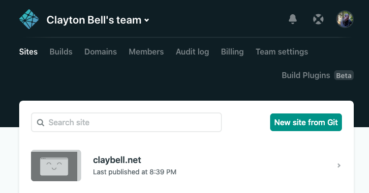

# claybell.net

This site is produced with Gatsby framework and deployed to Netlify.

Source code here: <https://github.com/claytonfbell/claybell-net>



```js
import React from "react"
import mnwAutomation from "./images/mnw-automation/mnw-dock.png"
import { TechnologyName } from "./technologies"

export type RoutePath = "/" | "/mnw-automation" | "/claybell-net"

interface Page {
  route: RoutePath
  title: string
  displayOnHome?: boolean
  description?: string
  image?: string
  technologies?: TechnologyName[]
}

export const pages: Page[] = [
  {
    route: "/",
    title: "Home",
  },
  {
    route: "/mnw-automation",
    displayOnHome: true,
    title: "New Electron App",
    image: mnwAutomation,
    description: `An Electron side-project application for Montessori Northwest.`,
    technologies: ["Electron", "React", "TypeScript", "Material UI"],
  },
  {
    route: "/claybell-net",
    displayOnHome: true,
    title: "claybell.net",
    image: mnwAutomation,
    description: `This blog / portfolio site.`,
    technologies: ["Gatsby", "React", "TypeScript", "Material UI", "Netlify"],
  },
]

export default () => <></>

```
