# Keyboards

I've recently been interested in building mechanical keyboards.

## 75% Orange

- PCB `kbd75-rev1`
- Cherry Brown Switches

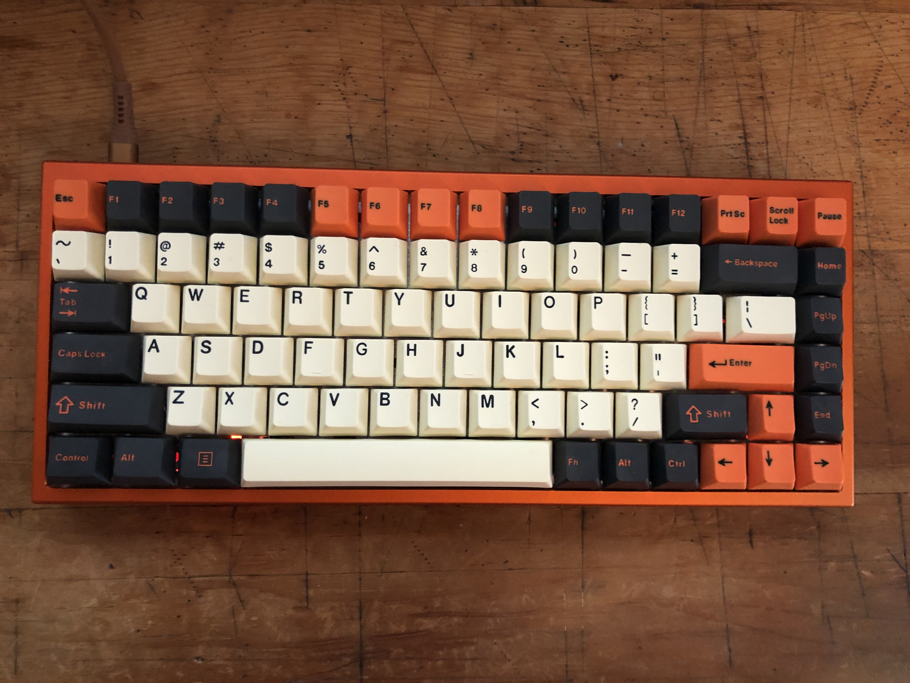

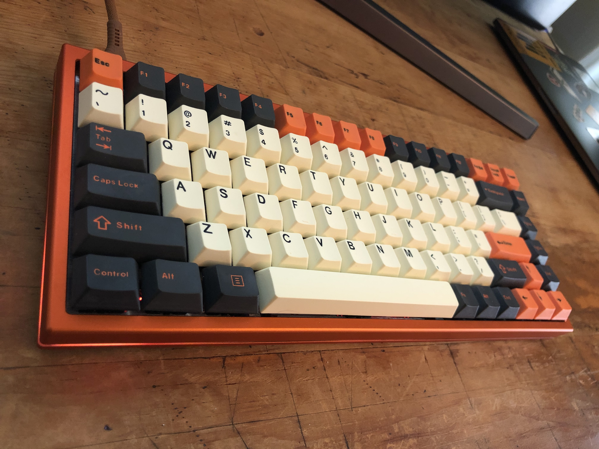

## 60% Black

- PCB `dz60rgbv2`
- Cherry Blue Switches
- MAXKEY BLACK DOUBLESHOT ABS SA KEYCAPS

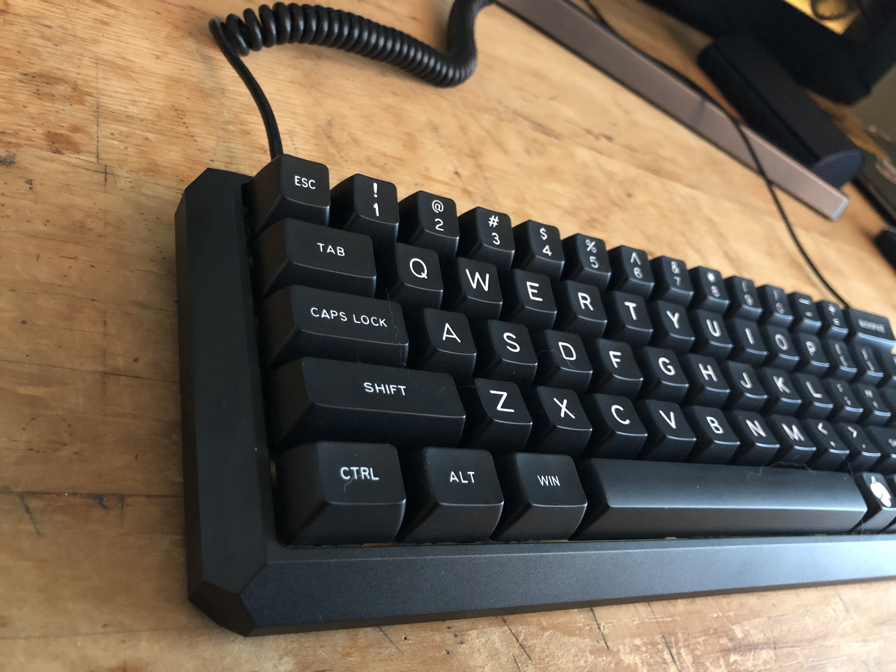

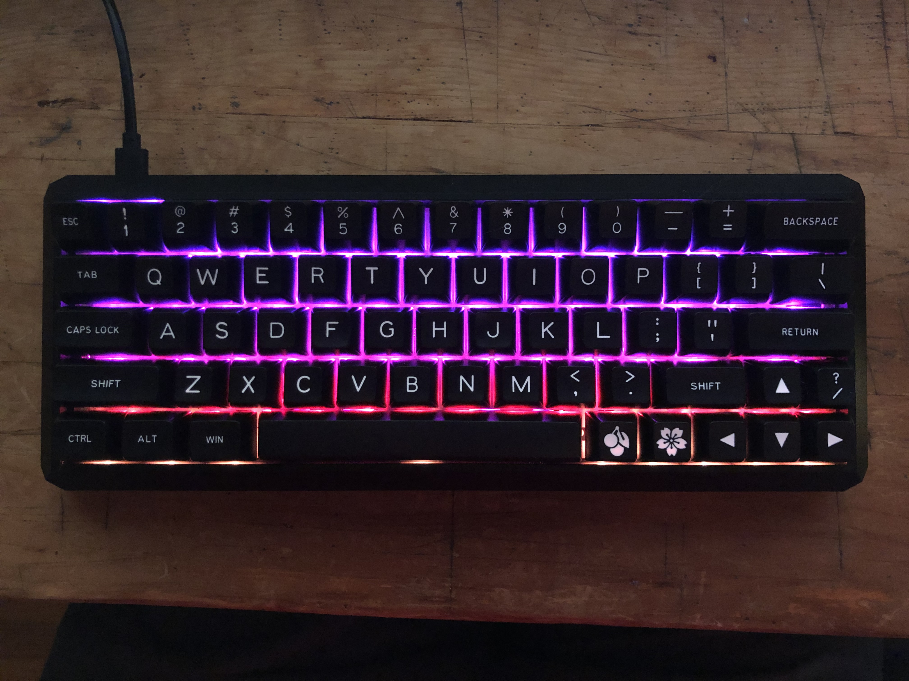

## 60% Wood Case with Magnetic Lid

- PCB `bm60rgb`
- Cherry Chalk-A PBT Keycaps
- Cherry Brown Switches

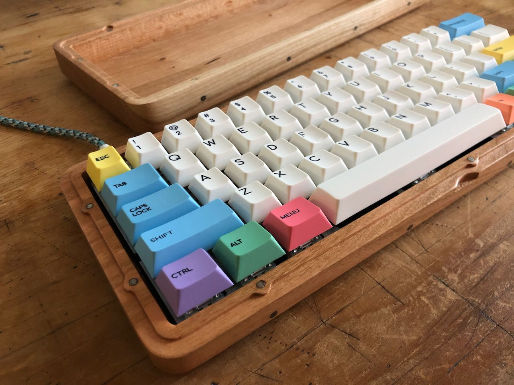

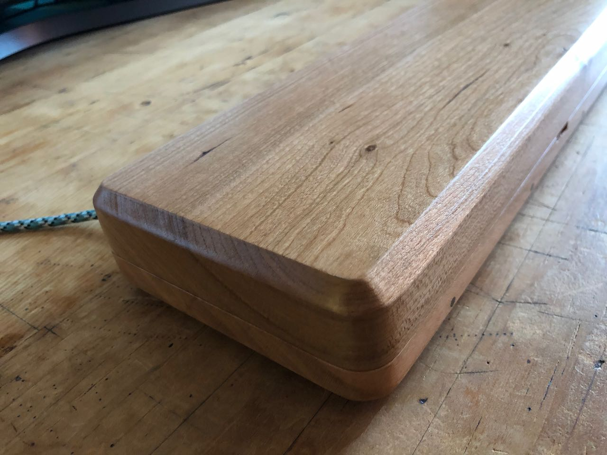

## 60% Yellow Keyboard

- Case MelGeek Mojo60
- PCB `dz60`
- Cherry Pbt dyesub Keycaps
- Cherry Blue Switches

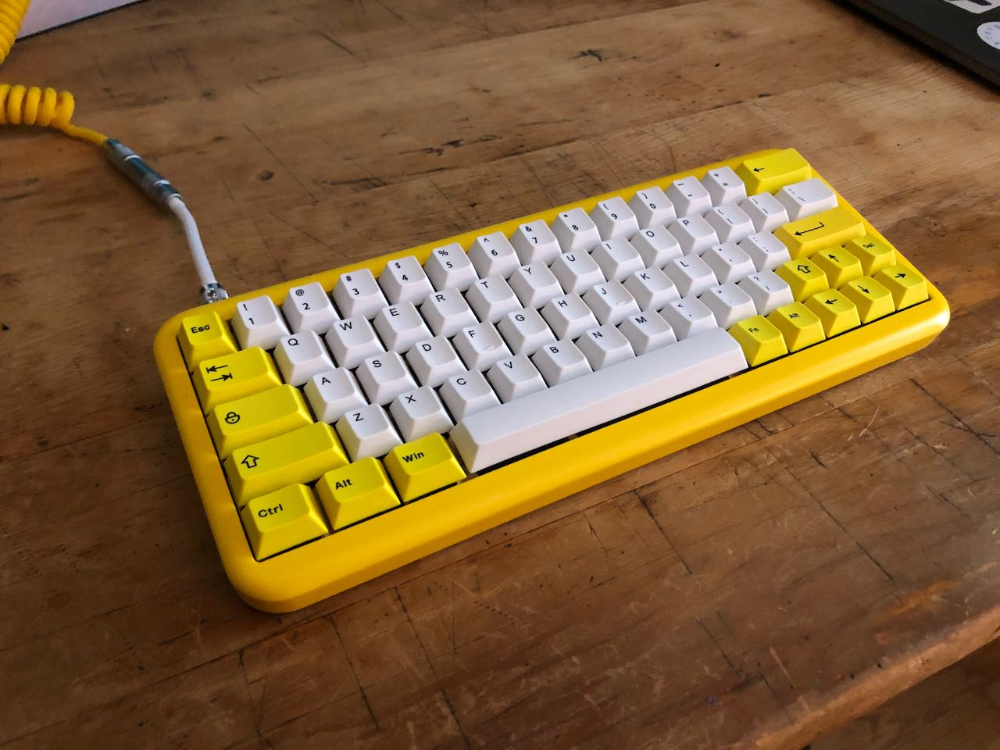

## 65% Stainless Steel Sandwich Board

- PCB `kbdfans/kbd67/mkiirgb/v1`
- DSA Keycaps
- Cherry Brown Switches

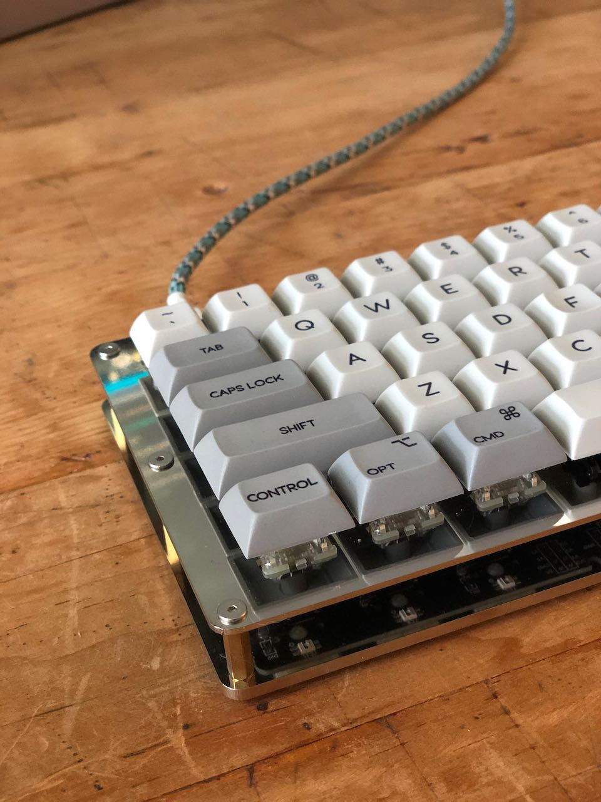

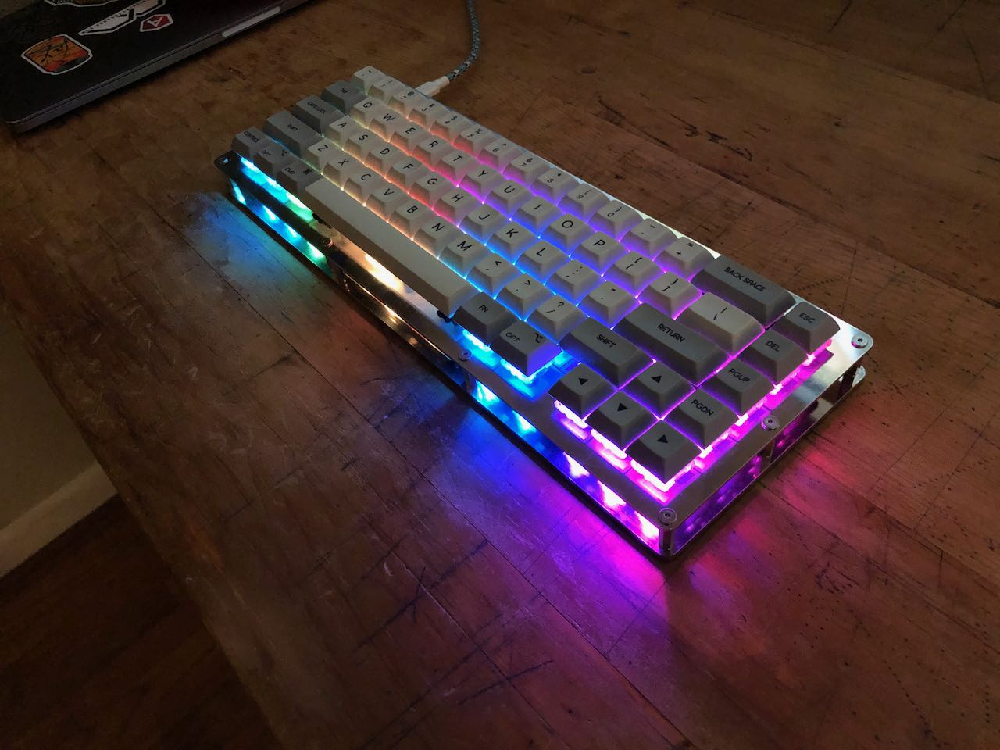

## 40% and 20% Red

- PCB `bm43a`
- SA Ice Cap Keyset
- Cherry Brown Switches

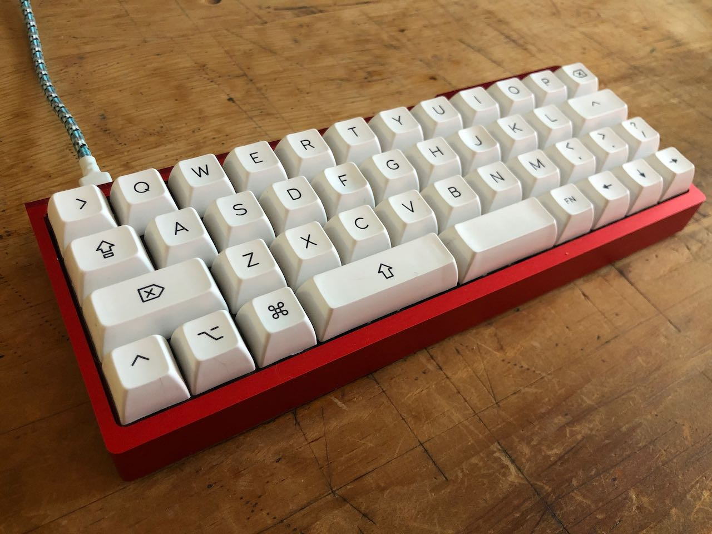

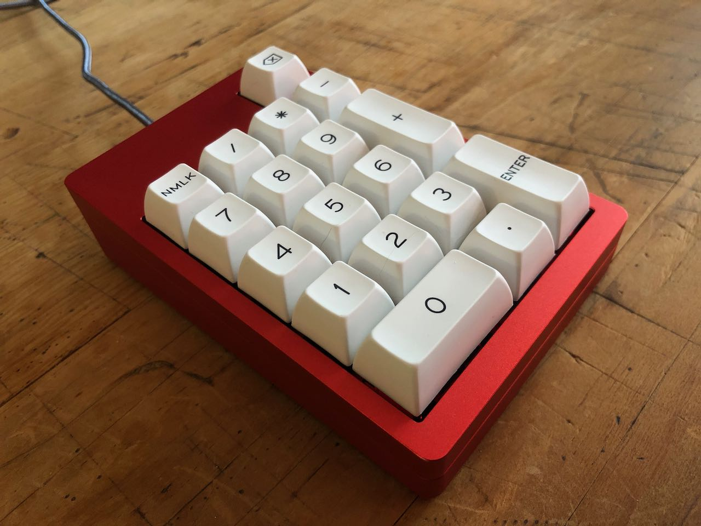

## 65% Keyboards

- PCB `dz65rgb`
- SA 1976 Keycaps
- Cherry Keycaps
- Cherry Brown Switches

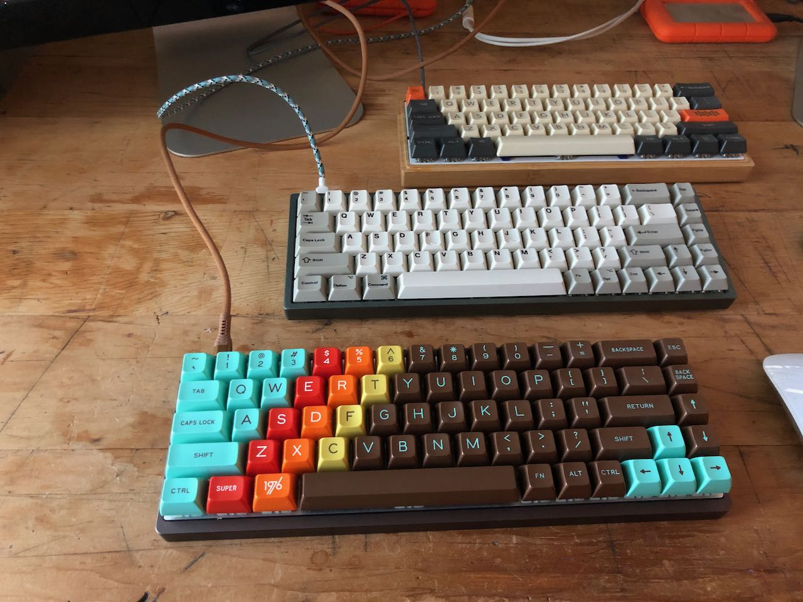
