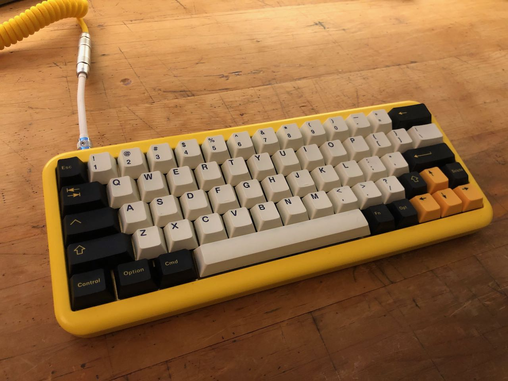

# Keyboards

## Laser Cut Stainless Steel

<!--  -->

## Laser Cut Copper

<!--  -->

## Laser Cut Brass with printed PCB

## Ryloo Studio "Hello" M0110

## 75% Orange

- PCB `kbd75-rev1`
- Cherry Brown Switches

## 60% Black

- PCB `dz60rgbv2`
- Cherry Blue Switches
- MAXKEY BLACK DOUBLESHOT ABS SA KEYCAPS

## 60% Wood Case with Magnetic Lid

- PCB `bm60rgb`
- Cherry Chalk-A PBT Keycaps
- Cherry Brown Switches

## 60% Yellow Keyboard

- Case MelGeek Mojo60
- PCB `dz60`
- Cherry Pbt dyesub Keycaps
- Cherry Blue Switches

## 40% and 20% Red

- PCB `bm43a`
- SA Ice Cap Keyset
- Cherry Brown Switches

## 65% Keyboards

- PCB `dz65rgb`
- SA 1976 Keycaps
- Cherry Keycaps
- Cherry Brown Switches

