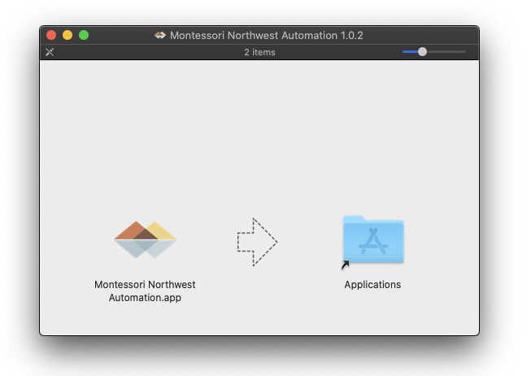
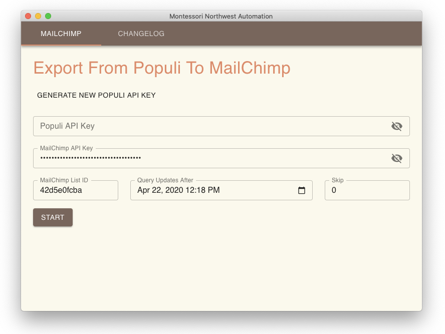
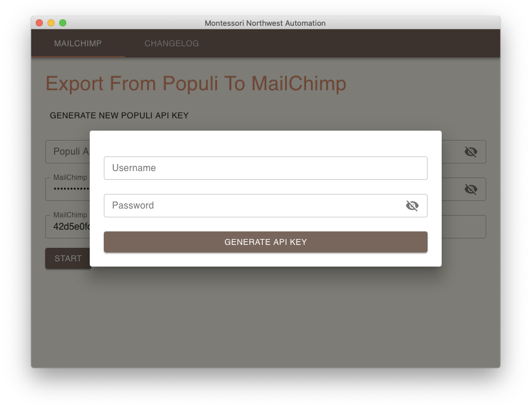

# New Electron App

As a side project I've built an Electon App for [Montessori Northwest](https://montessori-nw.org) training center to help them sync data between platforms.

Source code here: <https://github.com/claytonfbell/mnw-automation>



## What It Does

- Queries Populi's REST API to lookup updated contacts from the last synchronization.
- Updates the contacts in MailChimp's API.

### Snippet

```js
const response = await axios.default
  .post(
    `https://montessorinorthwest.populiweb.com/api/`,
    querystring.stringify({
      task: "getUpdatedPeople",
      start_time: moment(state.startTime).format("YYYY-MM-DD HH:mm:ss"),
      offset,
    }),
    {
      headers: {
        "Content-Type": "application/x-www-form-urlencoded",
        Authorization: state.populiApiKey,
      },
    }
  )
  .then(resp => {
    return xml2json(resp.data) as Promise<GetUpdatedPeopleResponse>
  })
```



