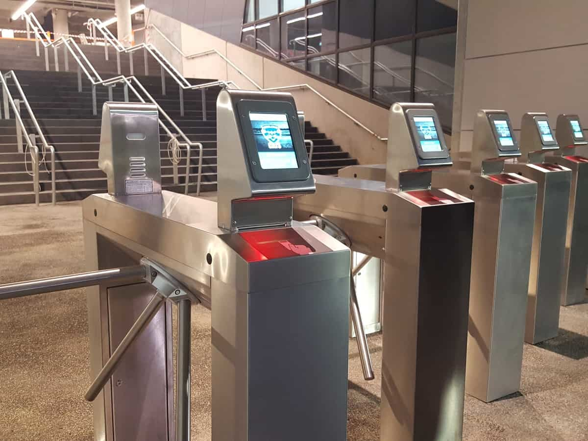
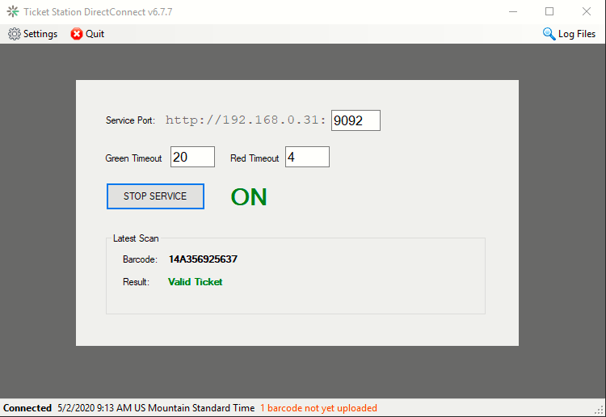
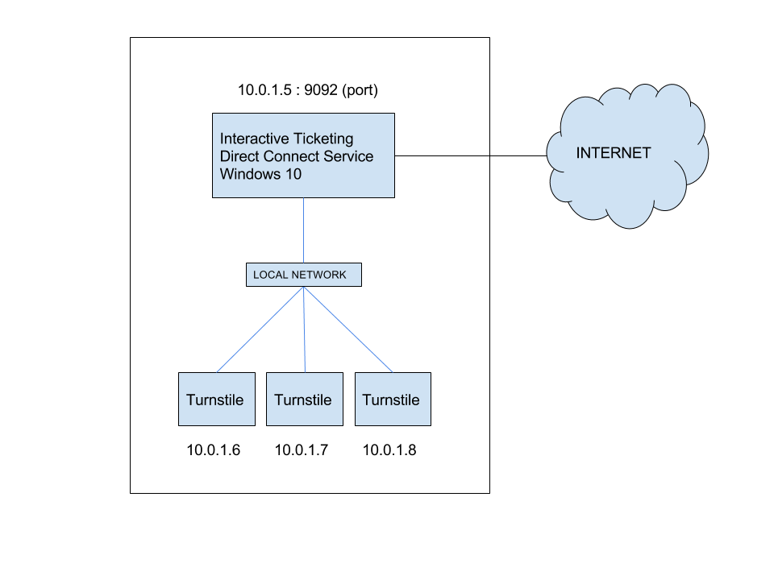
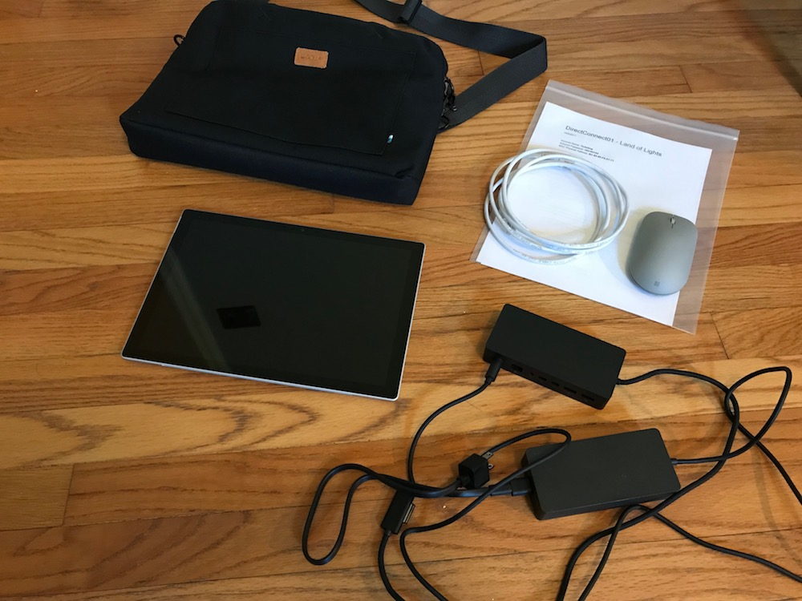

# Turnstile Integration

A couple years ago I was tasked with integrating our platform with this turnstile hardware. Visitors bring their paper or mobile ticket to the barcode reader on the turnstile which sends a request to our application to validate it and return the response back to the turnstile.

The client already ordered the hardware through a vendor just weeks before their opening.

I built a SOAP interface (an older technology not as common today) without having any access to the turnstile hardware that would use it. It had to be function exactly to spec otherwise the turnstiles would not operate against it to validate tickets. To achieve this I had to also write my own client software to simulate a turnstile for test purposes.

I reorganized the code for our existing Windows scanning application into a library that could be shared and packaged with this new application that runs as a local server.

Here is a diagram I shared after I came up with a plan.

When completed, I shipped a brand new Surface Pro loaded with the software to the Fair. I included a nice case and some quick-setup documentation.
When they arrived, the hardware vendor onsite changes some settings on their end to find our application and it .....worked!

